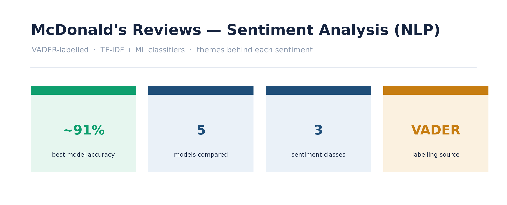
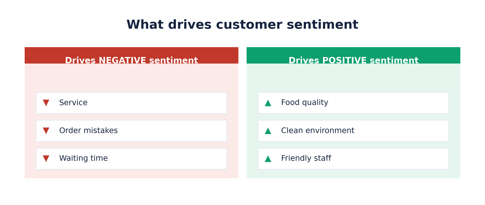

# 🍔 McDonald's Customer Reviews — Sentiment Analysis (NLP)

An NLP pipeline that classifies customer reviews as **positive, negative or neutral**, then
surfaces the recurring *themes* behind each sentiment — the part that actually tells a business
what to fix. Labels are generated with **VADER** (a rule-based analyzer) and used as the
training target, so the ML classifiers learn to reproduce VADER's sentiment at scale.

> **Business question:** *What are customers happy and unhappy about — and can we classify
> and explain that sentiment automatically, at scale?*



---

## 🔑 Key Results

| Area | Insight |
|---|---|
| 🏆 Best models | **Logistic Regression** & **Passive Aggressive** — **~91–92% accuracy** reproducing the VADER labels |
| 🧪 Models compared | Logistic Regression, Passive Aggressive, Multinomial NB, Bernoulli NB, SVC |
| 👎 Negative drivers | **Service, order mistakes, waiting time** |
| 👍 Positive drivers | Food quality, clean environment, friendly staff |
| 📏 Evaluation | Accuracy, precision, recall and F1 — not accuracy alone |

---

## 🗂️ Workflow

| Stage | What it does |
|---|---|
| Data cleaning & preprocessing | Text cleaning, tokenisation, stopword removal, lemmatisation |
| Sentiment labelling | **VADER** assigns each review a positive / negative / neutral label from its compound score |
| Classification | **TF-IDF** vectorisation + train & compare **five** ML classifiers to reproduce the labels |
| Evaluation | Accuracy, precision, recall, F1, and cross-validation |
| Insights & visualisation | Most common words per sentiment; drivers of positive vs negative reviews |

---

## 📊 Visual Highlights

**The themes behind each sentiment — what to fix, and what's working.**



---

## 🧰 Tech Stack

`Python` · `pandas` · `numpy` · `NLTK` · `scikit-learn` · `Matplotlib` · `Seaborn`

---

## ▶️ How to Run

```bash
# 1. Clone
git clone https://github.com/shashank-s-k/Customer-Sentiment-Analysis.git
cd Customer-Sentiment-Analysis

# 2. (Recommended) create a virtual environment
python -m venv .venv
source .venv/bin/activate          # Windows: .venv\Scripts\activate

# 3. Install dependencies
pip install -r requirements.txt

# 4. Open and run the notebook top to bottom
jupyter lab            # then open "Sentiment Analysis.ipynb"
```

The notebook expects the dataset at `MCReview.csv` (update the path in the load cell if needed).

---

## 📁 Repository Structure

```
Customer-Sentiment-Analysis/
├── Sentiment Analysis.ipynb   # cleaning → VADER labels → TF-IDF → 5 models → insights
├── MCReview.csv               # McDonald's reviews dataset
├── reports/
│   └── figures/               # exported PNG charts used in this README
├── requirements.txt
└── README.md
```

---

## ⚖️ Methodology Notes (the honest bits)

- **Labels are VADER-generated, not human-annotated:** sentiment is assigned by a rule-based
  analyzer (VADER) and then used as the ML training target — so the ~91% accuracy measures how
  well the classifiers *reproduce VADER's labels*, not agreement with human judgement. A natural
  next step is validating against a hand-labelled sample.
- **TF-IDF + classical classifiers as strong, interpretable baselines:** fast to train and easy
  to explain *why* a review was classified a certain way — valuable when the goal is insight,
  not just a score.
- **Accuracy isn't the whole story:** with uneven class sizes, per-class precision/recall and
  F1 matter more than headline accuracy, so all are reported alongside cross-validation.
- **Insight over score:** the project deliberately extracts the *drivers* of each sentiment
  (service, wait times, food quality) rather than stopping at a classification metric.

## 🔭 Future Improvements
- Aspect-based sentiment analysis (rate *service* vs *food* vs *price* separately)
- n-gram and embedding-based features
- Deep-learning models (e.g. fine-tuned transformers) for a fair accuracy comparison
